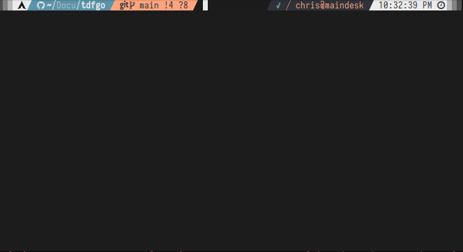
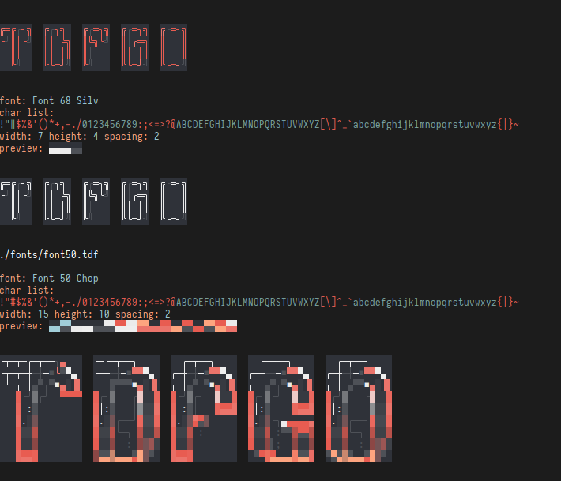

## tdfgo

[TheDraw](https://en.wikipedia.org/wiki/TheDraw) font parser and console text renderer.  

> The CLI utility and library currently only support **COLOR** font types. **BLOCK** and **OUTLINE** will fail with a note.



<!--  -->
### `Help`


### `Clock`


Using the selected font and specified options output a clock to the terminal

### `Fonts`



List all fonts found by the utility. 

##### The font directories searched:

- `.` 
- `./fonts`
- `/usr/share/tdfgo/fonts`
- `/usr/local/share/tdfgo/fonts`
- `~/.config/tdfgo/fonts`
- Built-in (There are two fonts `mindstax.tdf` and `yazoox.tdf` embedded within the binary for use anywhere)

### Options

```
  -w, --columns int      Specify the amount of columns or width that the text will be rendered into (default 80)
  -f, --font string      Specify font to use for TEXT if multiple uses first (default "mindstax")
  -i, --fontIndex int    If multiple fonts per file specify the index of the font to use (default 0)
  -h, --help             help for tdfgo
  -j, --justify string   Specify the justification for rendered content, computes padding if necessary given current terminal width. {left, center, justify} (default "left")
  -m, --monochrome       Render text in monochrome by stripping color escape sequences. Will then be using the default foreground color
  -r, --random           Use a random font as the selected font when rendering text content
  -W, --spaceWidth int   Set the spacing for a space character in the text provided (default 3)
  -s, --spacing int      Override the fonts own specified spacing used between characters. (default -1)
  -v, --verbose          Print more information about fonts
```


